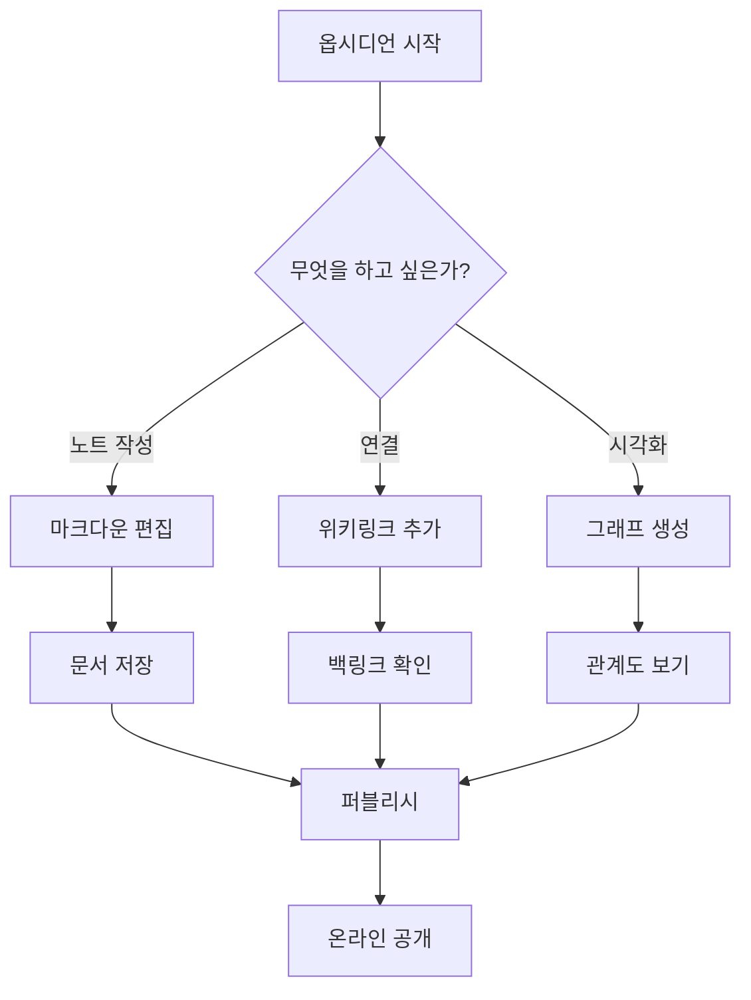
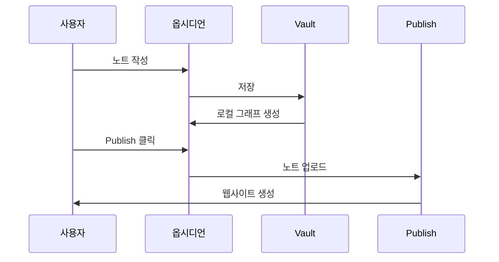
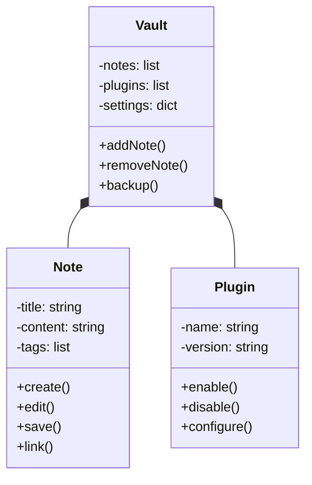
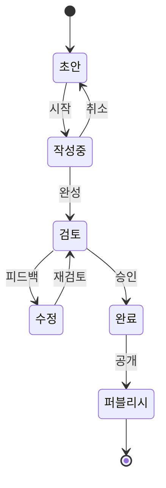
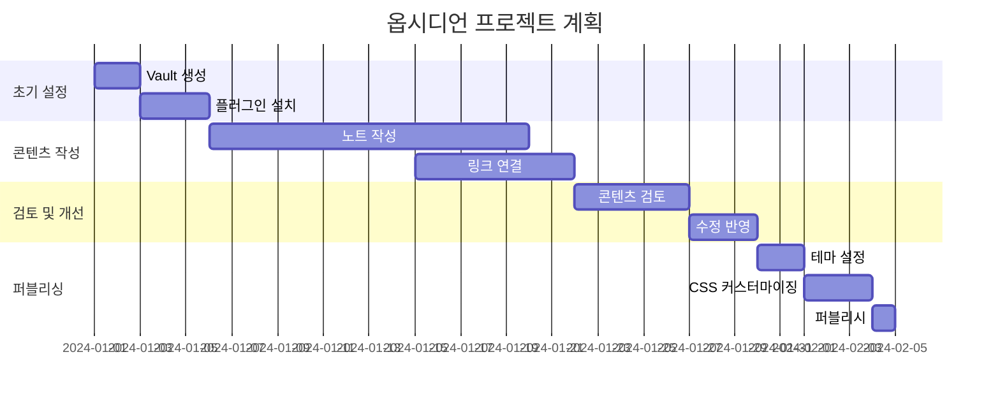
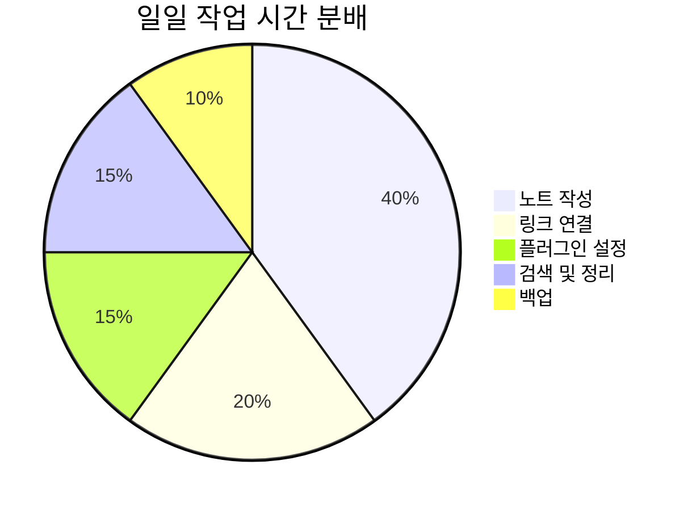
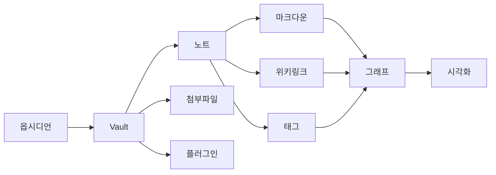
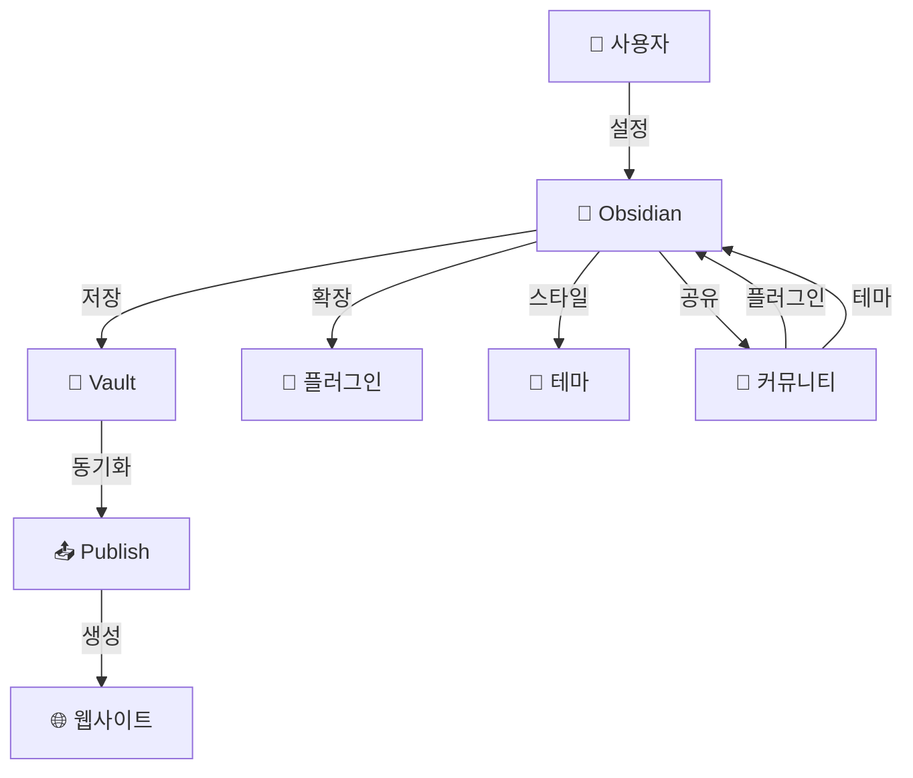

# Obsidian 시각화 예시 모음

Obsidian 기본 기능으로 표현할 수 있는 그래프, 다이어그램, 표, 차트 등의 예시를 모았습니다.

---

## 1. Mermaid 다이어그램 (기본 지원)

### 1.1 플로우차트 (Flowchart)



### 1.2 시퀀스 다이어그램 (Sequence)



### 1.3 클래스 다이어그램 (Class)



### 1.4 상태 다이어그램 (State)



### 1.5 간트 차트 (Gantt)



### 1.6 파이 차트 (Pie)



### 1.7 막대 차트 (Bar)

```mermaid
bar
    title 월별 노트 작성 수
    x-axis 1월, 2월, 3월, 4월, 5월
    y-axis 작성 수, 0, 50
    bar 15, 25, 30, 35, 40
```

### 1.8 그래프 (Graph)



---

## 2. 마크다운 표 (Markdown Tables)

### 2.1 기본 표

| 기능 | 설명 | 사용법 |
|------|------|--------|
| 위키링크 | 내부 노트 연결 | `[[노트명]]` |
| 태그 | 주제 분류 | `#tag-name` |
| 백링크 | 역방향 링크 | 자동 생성 |
| 그래프 | 관계도 시각화 | 기본 제공 |
| 검색 | 노트 찾기 | Ctrl+P |

### 2.2 학습 진도율 표

| 과목         | 완료도               | 상태  |
| ---------- | ----------------- | --- |
| TypeScript | ████████░░ 80%    | 진행중 |
| React      | ██████░░░░ 60%    | 진행중 |
| Node.js    | █████░░░░░ 50%    | 미시작 |
| Docker     | ████████████ 100% | 완료  |
| Kubernetes | ██░░░░░░░░ 20%    | 미시작 |

### 2.3 비용 추적 표

| 항목 | 월비용 | 갱신일 | 상태 |
|------|--------|--------|------|
| ChatGPT Pro | $20 | 15일 | ✅ 구독 |
| Claude Pro | $20 | 20일 | ✅ 구독 |
| Netflix | $13.99 | 10일 | ✅ 구독 |
| 합계 | $53.99 | - | - |

### 2.4 비교 분석 표

| 기준 | Obsidian | Notion | OneNote |
|------|----------|--------|---------|
| 로컬 저장 | ✅ | ❌ | ✅ |
| 마크다운 | ✅ | ❌ | ❌ |
| 그래프 뷰 | ✅ | ✅ | ❌ |
| 플러그인 | ✅ | ✅ | ❌ |
| 무료 버전 | ✅ | ✅ | ✅ |
| 오프라인 | ✅ | ❌ | ✅ |

---

## 3. 체크리스트 및 리스트

### 3.1 체크리스트

```
## 프로젝트 체크리스트

### 계획 단계
- [x] 목표 정의
- [x] 일정 수립
- [ ] 리소스 배분
- [ ] 예산 책정

### 실행 단계
- [ ] 팀 구성
- [ ] 작업 시작
- [ ] 진행 상황 모니터링
- [ ] 이슈 관리

### 완료 단계
- [ ] 최종 검토
- [ ] 결과 보고
- [ ] 아카이빙
- [ ] 회고
```

### 3.2 우선순위 리스트

```
## 오늘의 할 일

### 🔴 긴급 (높은 우선순위)
- [ ] 보고서 완성
- [ ] 클라이언트 피드백 처리

### 🟡 중요 (중간 우선순위)
- [x] 메일 답장
- [ ] 팀 미팅 준비
- [ ] 코드 리뷰

### 🟢 일반 (낮은 우선순위)
- [x] 문서 정리
- [ ] 사무용품 구매
- [ ] 블로그 포스팅
```

---

## 4. 칼럼 레이아웃 (CSS Grid 활용)

```html
<div style="display: grid; grid-template-columns: 1fr 1fr; gap: 20px;">

<div>

### 왼쪽 컬럼

- 포인트 1
- 포인트 2
- 포인트 3

</div>

<div>

### 오른쪽 컬럼

- 내용 1
- 내용 2
- 내용 3

</div>

</div>
```

---

## 5. 하이라이트 및 색상 박스

### 5.1 색상 배경 텍스트 (HTML)

```html
<p style="background-color: #e3f2fd; padding: 10px; border-radius: 5px;">
  💡 <strong>팁:</strong> 이것은 정보 박스입니다.
</p>

<p style="background-color: #fff3e0; padding: 10px; border-radius: 5px;">
  ⚠️ <strong>주의:</strong> 이것은 경고 박스입니다.
</p>

<p style="background-color: #e8f5e9; padding: 10px; border-radius: 5px;">
  ✅ <strong>성공:</strong> 이것은 성공 메시지입니다.
</p>

<p style="background-color: #ffebee; padding: 10px; border-radius: 5px;">
  ❌ <strong>오류:</strong> 이것은 오류 메시지입니다.
</p>
```

### 5.2 인용문 스타일

```
> 💭 **인용문**
> 이것은 중요한 인용문입니다.
> 여러 줄로 표현할 수 있습니다.

> 📌 **노트**
> 기억할 만한 정보입니다.

> 🔗 **참고자료**
> 관련 자료 링크: [[관련노트]]
```

---

## 6. Dataview를 이용한 동적 목록

### 6.1 특정 태그의 노트 자동 나열

```dataview
LIST
WHERE contains(tags, "python")
SORT file.name
```

### 6.2 완료도 기준 테이블

```dataview
TABLE completion, status
WHERE type = "project"
SORT completion DESC
```

### 6.3 날짜별 정렬

```dataview
LIST file.ctime
WHERE file.folder = "daily-notes"
SORT file.ctime DESC
LIMIT 10
```

---

## 7. 마인드맵 (텍스트 기반)

```
## 옵시디언 구성

### 1. 핵심 기능
├── 노트 작성
│   ├── 마크다운
│   └── YAML 프론트매터
├── 링크
│   ├── 위키링크
│   └── 백링크
└── 검색
    ├── 전체 검색
    └── 정규식 검색

### 2. 시각화
├── 그래프 뷰
│   ├── 전역 그래프
│   └── 로컬 그래프
├── 타임라인
└── 칼렌더

### 3. 확장성
├── 플러그인
│   ├── 커뮤니티 플러그인
│   └── 커스텀 플러그인
└── 테마
    ├── 커뮤니티 테마
    └── CSS 커스터마이징
```

---

## 8. 타이밍라인 (Timeline)

```
## 프로젝트 타임라인

**2024년 1월**
- 프로젝트 킥오프
- 팀 구성

**2024년 2월**
- 요구사항 정의 완료
- 초기 설계 시작

**2024년 3월**
- 개발 시작
- 중간 검토

**2024년 4월**
- 베타 테스트
- 피드백 수집

**2024년 5월**
- 최종 수정
- 론칭 준비

**2024년 6월**
- 공식 론칭 🚀
- 모니터링 시작
```

---

## 9. 의사결정 트리 (Decision Tree)

```
## 옵시디언 설치 결정

노트 작성 도구가 필요한가?
│
├─ YES: 클라우드 저장을 원하나?
│        │
│        ├─ YES → Notion, OneNote 추천
│        │
│        └─ NO: 마크다운을 선호하나?
│               │
│               ├─ YES → Obsidian ✅ (최고)
│               │
│               └─ NO → Logseq, Roam 추천
│
└─ NO: 다른 도구 선택
```

---

## 10. 점진적 공개 (Progressive Disclosure)

### 시니어 개발자 로드맵

<details>
<summary><strong>기초 (클릭하여 확인)</strong></summary>

- [ ] HTML/CSS 기초
- [ ] JavaScript 기초
- [ ] Git 기초
- [ ] REST API 이해

</details>

<details>
<summary><strong>중급 (클릭하여 확인)</strong></summary>

- [ ] React 기초
- [ ] Node.js 기초
- [ ] 데이터베이스 설계
- [ ] 테스트 작성

</details>

<details>
<summary><strong>고급 (클릭하여 확인)</strong></summary>

- [ ] 시스템 설계
- [ ] 성능 최적화
- [ ] 보안 고려사항
- [ ] 마이크로서비스

</details>

---

## 11. 네트워크 다이어그램 (Mermaid Graph)



---

## 12. 칸반 보드 (ASCII Art)

```
## 프로젝트 칸반

### 📋 TODO | 🏃 IN PROGRESS | ✅ DONE

#### TODO
- [ ] 기능 1
- [ ] 기능 2
- [ ] 버그 수정

#### IN PROGRESS
- 🔄 API 구현
- 🔄 UI 디자인

#### DONE
- ✅ 데이터베이스 설계
- ✅ 초기 셋업
- ✅ 문서 작성
```

---

## 13. 비교 다이어그램 (Venn Diagram - 텍스트)

```
## Obsidian vs Notion vs Roam 비교

Obsidian만의 특징: 로컬 저장, 완전한 오프라인
Notion만의 특징: 팀 협업, 데이터베이스 기능

공통점: 마크다운, 백링크, 플러그인 지원

Roam만의 특징: 실시간 동기, 그래프 기반
```

---

## 14. 색상 코드 참조

```
## 중요도별 색상 코드

🔴 긴급/높음: #FF0000 
🟠 중간상: #FFA500
🟡 중간: #FFFF00
🟢 낮음: #00FF00
🔵 정보: #0000FF
🟣 완료: #800080
```

---

## 활용 팁

### 💡 그래프 뷰 활용
- 위키링크를 많이 추가하면 Obsidian의 그래프 뷰가 자동으로 관계도를 시각화합니다.
- 그래프 뷰에서 노트 간의 연결 관계를 한눈에 파악할 수 있습니다.

### 💡 이모지 활용
- 다양한 이모지를 사용하여 시각적 구분을 강화합니다.
- 검색 시에도 이모지를 포함하여 검색할 수 있습니다.

### 💡 Dataview 플러그인
- Dataview를 설치하면 동적 목록 생성이 가능합니다.
- 태그, 날짜, 커스텀 필드 등으로 자동 정렬 가능합니다.

### 💡 Mermaid 활용
- 복잡한 프로세스를 다이어그램으로 표현할 수 있습니다.
- 플로우차트, 시퀀스, 클래스 다이어그램 등 다양한 형식 지원합니다.

---

*마지막 업데이트: 2026년 3월*
