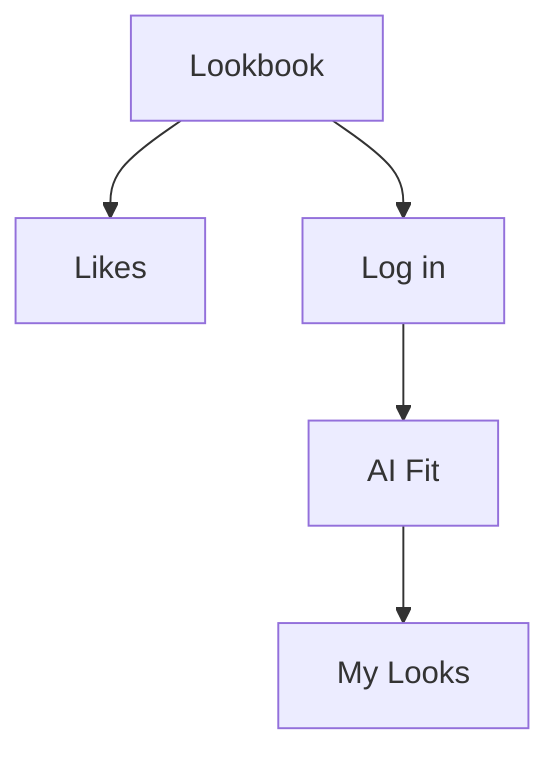

#tag

첫페이지 입니다.

![[Pasted image 20260630101120.png]]

![[Pasted image 20260702165226.png]]

#test

<svg xmlns="http://www.w3.org/2000/svg" viewBox="-0.075 -0.075 24.150 24.150" width="512" height="512" role="img" aria-label="mobile-wifi_20260704-112853">
      <g id="frame-group">
        <g id="slot-full"><path xmlns="http://www.w3.org/2000/svg" class="arc" d="M 2.5 5.8 H 21.5 A 1.5 1.5 0 0 1 23 7.3 V 16.7 A 1.5 1.5 0 0 1 21.5 18.2 H 2.5 A 1.5 1.5 0 0 1 1 16.7 V 7.3 A 1.5 1.5 0 0 1 2.5 5.8 Z"/>
  <circle xmlns="http://www.w3.org/2000/svg" class="dot" cx="2.7" cy="12" r="0.55"/></g>
        <g id="slot-tl"/>
        <g id="slot-tr"/>
        <g id="slot-bl"/>
        <g id="slot-br"/>
      </g>
      <g id="slot-ins-wrap" transform="translate(0,0) translate(12,12) scale(0.85) translate(-12,-12)">
        <g id="slot-ins-back-outline" transform="translate(0,0) translate(12,12) scale(1) translate(-12,-12)"/>
        <g id="slot-ins-back" transform="translate(0,0) translate(12,12) scale(1) translate(-12,-12)"/>
        <g id="slot-ins-front-outline" transform="translate(0,0) translate(12,12) scale(1) translate(-12,-12)"/>
        <g id="slot-ins-front" transform="translate(0,0) translate(12,12) scale(1) translate(-12,-12)"><g xmlns="http://www.w3.org/2000/svg" transform="translate(6,6) scale(0.5)">
    <path class="ins" style="stroke-width:calc(var(--stroke-w)*2.2)" d="M 3.5 9.5 A 12 12 0 0 1 20.5 9.5"/>
    <path class="ins" style="stroke-width:calc(var(--stroke-w)*2.2)" d="M 6.34 12.34 A 8 8 0 0 1 17.66 12.34"/>
    <path class="ins" style="stroke-width:calc(var(--stroke-w)*2.2)" d="M 9.17 15.17 A 4 4 0 0 1 14.83 15.17"/>
    <circle class="ins-dot" cx="12" cy="18" r="1.5"/>
  </g></g>
      </g>
    </svg>
    

<?xml version="1.0" encoding="UTF-8"?>
<svg xmlns="http://www.w3.org/2000/svg" viewBox="-0.075 -0.075 24.150 24.150" width="512" height="512" role="img" aria-label="mobile-wifi_20260704-112853">
      <g id="frame-group">
        <g id="slot-full"><path xmlns="http://www.w3.org/2000/svg" d="M 2.5 5.8 H 21.5 A 1.5 1.5 0 0 1 23 7.3 V 16.7 A 1.5 1.5 0 0 1 21.5 18.2 H 2.5 A 1.5 1.5 0 0 1 1 16.7 V 7.3 A 1.5 1.5 0 0 1 2.5 5.8 Z" fill="rgb(28, 28, 23)" stroke="rgb(245, 244, 236)" stroke-width="0.75" stroke-linecap="round" stroke-linejoin="round"/>
  <circle xmlns="http://www.w3.org/2000/svg" cx="2.7" cy="12" r="0.55" fill="rgb(245, 244, 236)" stroke="none"/></g>
        <g id="slot-tl"/>
        <g id="slot-tr"/>
        <g id="slot-bl"/>
        <g id="slot-br"/>
      </g>
      <g id="slot-ins-wrap" transform="translate(0,0) translate(12,12) scale(0.85) translate(-12,-12)">
        <g id="slot-ins-back-outline" transform="translate(0,0) translate(12,12) scale(1) translate(-12,-12)"/>
        <g id="slot-ins-back" transform="translate(0,0) translate(12,12) scale(1) translate(-12,-12)"/>
        <g id="slot-ins-front-outline" transform="translate(0,0) translate(12,12) scale(1) translate(-12,-12)"/>
        <g id="slot-ins-front" transform="translate(0,0) translate(12,12) scale(1) translate(-12,-12)"><g xmlns="http://www.w3.org/2000/svg" transform="translate(6,6) scale(0.5)">
    <path d="M 3.5 9.5 A 12 12 0 0 1 20.5 9.5" fill="none" stroke="rgb(255, 212, 0)" stroke-width="1.65" stroke-linecap="round" stroke-linejoin="round"/>
    <path d="M 6.34 12.34 A 8 8 0 0 1 17.66 12.34" fill="none" stroke="rgb(255, 212, 0)" stroke-width="1.65" stroke-linecap="round" stroke-linejoin="round"/>
    <path d="M 9.17 15.17 A 4 4 0 0 1 14.83 15.17" fill="none" stroke="rgb(255, 212, 0)" stroke-width="1.65" stroke-linecap="round" stroke-linejoin="round"/>
    <circle cx="12" cy="18" r="1.5" fill="rgb(255, 212, 0)" stroke="none"/>
  </g></g>
      </g>
    </svg>
    

