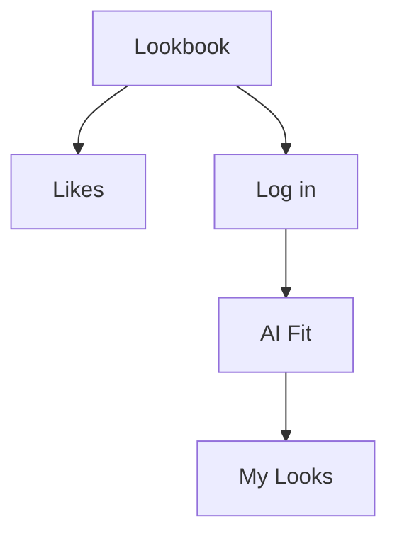

#tag

첫페이지 입니다.

![[Pasted image 20260630101120.png]]

![[Pasted image 20260702165226.png]]

#test

<svg xmlns="http://www.w3.org/2000/svg" viewBox="-0.075 -0.075 24.150 24.150" width="512" height="512" role="img" aria-label="mobile-wifi_20260704-112853">
      <g id="frame-group">
        <g id="slot-full"><path xmlns="http://www.w3.org/2000/svg" class="arc" d="M 2.5 5.8 H 21.5 A 1.5 1.5 0 0 1 23 7.3 V 16.7 A 1.5 1.5 0 0 1 21.5 18.2 H 2.5 A 1.5 1.5 0 0 1 1 16.7 V 7.3 A 1.5 1.5 0 0 1 2.5 5.8 Z"/>
  <circle xmlns="http://www.w3.org/2000/svg" class="dot" cx="2.7" cy="12" r="0.55"/></g>
        <g id="slot-tl"/>
        <g id="slot-tr"/>
        <g id="slot-bl"/>
        <g id="slot-br"/>
      </g>
      <g id="slot-ins-wrap" transform="translate(0,0) translate(12,12) scale(0.85) translate(-12,-12)">
        <g id="slot-ins-back-outline" transform="translate(0,0) translate(12,12) scale(1) translate(-12,-12)"/>
        <g id="slot-ins-back" transform="translate(0,0) translate(12,12) scale(1) translate(-12,-12)"/>
        <g id="slot-ins-front-outline" transform="translate(0,0) translate(12,12) scale(1) translate(-12,-12)"/>
        <g id="slot-ins-front" transform="translate(0,0) translate(12,12) scale(1) translate(-12,-12)"><g xmlns="http://www.w3.org/2000/svg" transform="translate(6,6) scale(0.5)">
    <path class="ins" style="stroke-width:calc(var(--stroke-w)*2.2)" d="M 3.5 9.5 A 12 12 0 0 1 20.5 9.5"/>
    <path class="ins" style="stroke-width:calc(var(--stroke-w)*2.2)" d="M 6.34 12.34 A 8 8 0 0 1 17.66 12.34"/>
    <path class="ins" style="stroke-width:calc(var(--stroke-w)*2.2)" d="M 9.17 15.17 A 4 4 0 0 1 14.83 15.17"/>
    <circle class="ins-dot" cx="12" cy="18" r="1.5"/>
  </g></g>
      </g>
    </svg>
    

<?xml version="1.0" encoding="UTF-8"?>
<svg xmlns="http://www.w3.org/2000/svg" viewBox="-0.075 -0.075 24.150 24.150" width="512" height="512" role="img" aria-label="mobile-wifi_20260704-112853">
      <g id="frame-group">
        <g id="slot-full"><path xmlns="http://www.w3.org/2000/svg" d="M 2.5 5.8 H 21.5 A 1.5 1.5 0 0 1 23 7.3 V 16.7 A 1.5 1.5 0 0 1 21.5 18.2 H 2.5 A 1.5 1.5 0 0 1 1 16.7 V 7.3 A 1.5 1.5 0 0 1 2.5 5.8 Z" fill="rgb(28, 28, 23)" stroke="rgb(245, 244, 236)" stroke-width="0.75" stroke-linecap="round" stroke-linejoin="round"/>
  <circle xmlns="http://www.w3.org/2000/svg" cx="2.7" cy="12" r="0.55" fill="rgb(245, 244, 236)" stroke="none"/></g>
        <g id="slot-tl"/>
        <g id="slot-tr"/>
        <g id="slot-bl"/>
        <g id="slot-br"/>
      </g>
      <g id="slot-ins-wrap" transform="translate(0,0) translate(12,12) scale(0.85) translate(-12,-12)">
        <g id="slot-ins-back-outline" transform="translate(0,0) translate(12,12) scale(1) translate(-12,-12)"/>
        <g id="slot-ins-back" transform="translate(0,0) translate(12,12) scale(1) translate(-12,-12)"/>
        <g id="slot-ins-front-outline" transform="translate(0,0) translate(12,12) scale(1) translate(-12,-12)"/>
        <g id="slot-ins-front" transform="translate(0,0) translate(12,12) scale(1) translate(-12,-12)"><g xmlns="http://www.w3.org/2000/svg" transform="translate(6,6) scale(0.5)">
    <path d="M 3.5 9.5 A 12 12 0 0 1 20.5 9.5" fill="none" stroke="rgb(255, 212, 0)" stroke-width="1.65" stroke-linecap="round" stroke-linejoin="round"/>
    <path d="M 6.34 12.34 A 8 8 0 0 1 17.66 12.34" fill="none" stroke="rgb(255, 212, 0)" stroke-width="1.65" stroke-linecap="round" stroke-linejoin="round"/>
    <path d="M 9.17 15.17 A 4 4 0 0 1 14.83 15.17" fill="none" stroke="rgb(255, 212, 0)" stroke-width="1.65" stroke-linecap="round" stroke-linejoin="round"/>
    <circle cx="12" cy="18" r="1.5" fill="rgb(255, 212, 0)" stroke="none"/>
  </g></g>
      </g>
    </svg>
    

<?xml version="1.0" encoding="UTF-8"?>
<svg xmlns="http://www.w3.org/2000/svg" viewBox="0.150 0.150 23.700 23.700" width="512" height="512" role="img" aria-label="obsidian_20260706-170101">
      <g id="frame-group">
        <g id="slot-full"/>
        <g id="slot-tl"><path xmlns="http://www.w3.org/2000/svg" d="M 12 12 L 1 12 A 11 11 0 0 1 12 1 Z" fill="rgb(28, 28, 23)" stroke="none"/>
  <path xmlns="http://www.w3.org/2000/svg" d="M 1 12 A 11 11 0 0 1 12 1" fill="none" stroke="rgb(245, 244, 236)" stroke-width="0.75" stroke-linecap="round" stroke-linejoin="round"/></g>
        <g id="slot-tr"><path xmlns="http://www.w3.org/2000/svg" d="M 12 12 L 12 1 A 11 11 0 0 1 23 12 Z" fill="rgb(28, 28, 23)" stroke="none"/>
  <path xmlns="http://www.w3.org/2000/svg" d="M 12 1 A 11 11 0 0 1 23 12" fill="none" stroke="rgb(245, 244, 236)" stroke-width="0.75" stroke-linecap="round" stroke-linejoin="round"/></g>
        <g id="slot-bl"><path xmlns="http://www.w3.org/2000/svg" d="M 12 12 L 12 23 A 11 11 0 0 1 1 12 Z" fill="rgb(28, 28, 23)" stroke="none"/>
  <path xmlns="http://www.w3.org/2000/svg" d="M 12 23 A 11 11 0 0 1 1 12" fill="none" stroke="rgb(245, 244, 236)" stroke-width="0.75" stroke-linecap="round" stroke-linejoin="round"/></g>
        <g id="slot-br"><path xmlns="http://www.w3.org/2000/svg" d="M 12 12 L 23 12 A 11 11 0 0 1 12 23 Z" fill="rgb(28, 28, 23)" stroke="none"/>
  <path xmlns="http://www.w3.org/2000/svg" d="M 23 12 A 11 11 0 0 1 12 23" fill="none" stroke="rgb(245, 244, 236)" stroke-width="0.75" stroke-linecap="round" stroke-linejoin="round"/></g>
      </g>
      <g id="slot-ins-wrap" transform="translate(0,0) translate(12,12) scale(0.85) translate(-12,-12)">
        <g id="slot-ins-back-outline" transform="translate(0,5) translate(12,12) scale(1) translate(-12,-12)"><text text-anchor="middle" dominant-baseline="central" font-size="6" fill="rgb(245, 244, 236)" stroke="rgb(245, 244, 236)" stroke-width="1.2" stroke-linecap="round" stroke-linejoin="round" font-family="Inter, -apple-system, &quot;Segoe UI&quot;, sans-serif" font-weight="800"><tspan x="12" y="12.00" fill="rgb(245, 244, 236)" stroke="rgb(245, 244, 236)" stroke-width="1.2" stroke-linecap="round" stroke-linejoin="round" font-family="Inter, -apple-system, &quot;Segoe UI&quot;, sans-serif" font-weight="800" font-size="6px">obsidian</tspan></text></g>
        <g id="slot-ins-back" transform="translate(0,5) translate(12,12) scale(1) translate(-12,-12)"><text text-anchor="middle" dominant-baseline="central" font-size="6" fill="rgb(142, 140, 130)" stroke="none" font-family="Inter, -apple-system, &quot;Segoe UI&quot;, sans-serif" font-weight="800"><tspan x="12" y="12.00" fill="rgb(142, 140, 130)" stroke="none" font-family="Inter, -apple-system, &quot;Segoe UI&quot;, sans-serif" font-weight="800" font-size="6px">obsidian</tspan></text></g>
        <g id="slot-ins-front-outline" transform="translate(0,-5) translate(12,12) scale(1) translate(-12,-12)"/>
        <g id="slot-ins-front" transform="translate(0,-5) translate(12,12) scale(1) translate(-12,-12)"><g xmlns="http://www.w3.org/2000/svg" transform="translate(6,6) scale(0.5)">
    <path d="M19.355 18.538a68.967 68.959 0 0 0 1.858-2.954.81.81 0 0 0-.062-.9c-.516-.685-1.504-2.075-2.042-3.362-.553-1.321-.636-3.375-.64-4.377a1.707 1.707 0 0 0-.358-1.05l-3.198-4.064a3.744 3.744 0 0 1-.076.543c-.106.503-.307 1.004-.536 1.5-.134.29-.29.6-.446.914l-.31.626c-.516 1.068-.997 2.227-1.132 3.59-.124 1.26.046 2.73.815 4.481.128.011.257.025.386.044a6.363 6.363 0 0 1 3.326 1.505c.916.79 1.744 1.922 2.415 3.5zM8.199 22.569c.073.012.146.02.22.02.78.024 2.095.092 3.16.29.87.16 2.593.64 4.01 1.055 1.083.316 2.198-.548 2.355-1.664.114-.814.33-1.735.725-2.58l-.01.005c-.67-1.87-1.522-3.078-2.416-3.849a5.295 5.295 0 0 0-2.778-1.257c-1.54-.216-2.952.19-3.84.45.532 2.218.368 4.829-1.425 7.531zM5.533 9.938c-.023.1-.056.197-.098.29L2.82 16.059a1.602 1.602 0 0 0 .313 1.772l4.116 4.24c2.103-3.101 1.796-6.02.836-8.3-.728-1.73-1.832-3.081-2.55-3.831zM9.32 14.01c.615-.183 1.606-.465 2.745-.534-.683-1.725-.848-3.233-.716-4.577.154-1.552.7-2.847 1.235-3.95.113-.235.223-.454.328-.664.149-.297.288-.577.419-.86.217-.47.379-.885.46-1.27.08-.38.08-.72-.014-1.043-.095-.325-.297-.675-.68-1.06a1.6 1.6 0 0 0-1.475.36l-4.95 4.452a1.602 1.602 0 0 0-.513.952l-.427 2.83c.672.59 2.328 2.316 3.335 4.711.09.21.175.43.253.653z" fill="rgb(255, 212, 0)" stroke="none"/>
  </g></g>
      </g>
    </svg>

<?xml version="1.0" encoding="UTF-8"?>
<svg xmlns="http://www.w3.org/2000/svg" viewBox="0 0 120 24" width="512" height="512" role="img" aria-label="grid_20260706-174415"><svg x="0" y="0" width="24" height="24" viewBox="-0.075 -0.075 24.150 24.150">
      <g id="frame-group">
        <g id="slot-full"><path xmlns="http://www.w3.org/2000/svg" d="M 2.5 5.8 H 21.5 A 1.5 1.5 0 0 1 23 7.3 V 16.7 A 1.5 1.5 0 0 1 21.5 18.2 H 2.5 A 1.5 1.5 0 0 1 1 16.7 V 7.3 A 1.5 1.5 0 0 1 2.5 5.8 Z" fill="rgb(28, 28, 23)" stroke="rgb(245, 244, 236)" stroke-width="0.75" stroke-linecap="round" stroke-linejoin="round"/>
  <circle xmlns="http://www.w3.org/2000/svg" cx="2.7" cy="12" r="0.55" fill="rgb(245, 244, 236)" stroke="none"/></g>
        <g id="slot-tl"/>
        <g id="slot-tr"/>
        <g id="slot-bl"/>
        <g id="slot-br"/>
      </g>
      <g id="slot-ins-wrap" transform="translate(0,0) translate(12,12) scale(0.85) translate(-12,-12)">
        <g id="slot-ins-back-outline" transform="translate(0,0) translate(12,12) scale(1) translate(-12,-12)"/>
        <g id="slot-ins-back" transform="translate(0,0) translate(12,12) scale(1) translate(-12,-12)"/>
        <g id="slot-ins-front-outline" transform="translate(0,0) translate(12,12) scale(1) translate(-12,-12)"/>
        <g id="slot-ins-front" transform="translate(0,0) translate(12,12) scale(1) translate(-12,-12)"><g xmlns="http://www.w3.org/2000/svg" transform="translate(6,6) scale(0.5)">
    <path d="M 3.5 9.5 A 12 12 0 0 1 20.5 9.5" fill="none" stroke="rgb(255, 212, 0)" stroke-width="1.65" stroke-linecap="round" stroke-linejoin="round"/>
    <path d="M 6.34 12.34 A 8 8 0 0 1 17.66 12.34" fill="none" stroke="rgb(255, 212, 0)" stroke-width="1.65" stroke-linecap="round" stroke-linejoin="round"/>
    <path d="M 9.17 15.17 A 4 4 0 0 1 14.83 15.17" fill="none" stroke="rgb(255, 212, 0)" stroke-width="1.65" stroke-linecap="round" stroke-linejoin="round"/>
    <circle cx="12" cy="18" r="1.5" fill="rgb(255, 212, 0)" stroke="none"/>
  </g></g>
      </g>
    </svg><svg x="48" y="0" width="24" height="24" viewBox="0.150 0.150 23.700 23.700">
      <g id="frame-group">
        <g id="slot-full"/>
        <g id="slot-tl"><path xmlns="http://www.w3.org/2000/svg" d="M 12 12 L 1 12 A 11 11 0 0 1 12 1 Z" fill="rgb(28, 28, 23)" stroke="none"/>
  <path xmlns="http://www.w3.org/2000/svg" d="M 1 12 A 11 11 0 0 1 12 1" fill="none" stroke="rgb(245, 244, 236)" stroke-width="0.75" stroke-linecap="round" stroke-linejoin="round"/></g>
        <g id="slot-tr"><path xmlns="http://www.w3.org/2000/svg" d="M 12 12 L 12 1 A 11 11 0 0 1 23 12 Z" fill="rgb(28, 28, 23)" stroke="none"/>
  <path xmlns="http://www.w3.org/2000/svg" d="M 12 1 A 11 11 0 0 1 23 12" fill="none" stroke="rgb(245, 244, 236)" stroke-width="0.75" stroke-linecap="round" stroke-linejoin="round"/></g>
        <g id="slot-bl"><path xmlns="http://www.w3.org/2000/svg" d="M 12 12 L 12 23 A 11 11 0 0 1 1 12 Z" fill="rgb(28, 28, 23)" stroke="none"/>
  <path xmlns="http://www.w3.org/2000/svg" d="M 12 23 A 11 11 0 0 1 1 12" fill="none" stroke="rgb(245, 244, 236)" stroke-width="0.75" stroke-linecap="round" stroke-linejoin="round"/></g>
        <g id="slot-br"><path xmlns="http://www.w3.org/2000/svg" d="M 12 12 L 23 12 A 11 11 0 0 1 12 23 Z" fill="rgb(28, 28, 23)" stroke="none"/>
  <path xmlns="http://www.w3.org/2000/svg" d="M 23 12 A 11 11 0 0 1 12 23" fill="none" stroke="rgb(245, 244, 236)" stroke-width="0.75" stroke-linecap="round" stroke-linejoin="round"/></g>
      </g>
      <g id="slot-ins-wrap" transform="translate(0,0) translate(12,12) scale(0.85) translate(-12,-12)">
        <g id="slot-ins-back-outline" transform="translate(0,5) translate(12,12) scale(1) translate(-12,-12)"><text text-anchor="middle" dominant-baseline="central" font-size="6" fill="rgb(245, 244, 236)" stroke="rgb(245, 244, 236)" stroke-width="1.2" stroke-linecap="round" stroke-linejoin="round" font-family="Inter, -apple-system, &quot;Segoe UI&quot;, sans-serif" font-weight="800"><tspan x="12" y="12.00" fill="rgb(245, 244, 236)" stroke="rgb(245, 244, 236)" stroke-width="1.2" stroke-linecap="round" stroke-linejoin="round" font-family="Inter, -apple-system, &quot;Segoe UI&quot;, sans-serif" font-weight="800" font-size="6px">obsidian</tspan></text></g>
        <g id="slot-ins-back" transform="translate(0,5) translate(12,12) scale(1) translate(-12,-12)"><text text-anchor="middle" dominant-baseline="central" font-size="6" fill="rgb(142, 140, 130)" stroke="none" font-family="Inter, -apple-system, &quot;Segoe UI&quot;, sans-serif" font-weight="800"><tspan x="12" y="12.00" fill="rgb(142, 140, 130)" stroke="none" font-family="Inter, -apple-system, &quot;Segoe UI&quot;, sans-serif" font-weight="800" font-size="6px">obsidian</tspan></text></g>
        <g id="slot-ins-front-outline" transform="translate(0,-5) translate(12,12) scale(1) translate(-12,-12)"/>
        <g id="slot-ins-front" transform="translate(0,-5) translate(12,12) scale(1) translate(-12,-12)"><g xmlns="http://www.w3.org/2000/svg" transform="translate(6,6) scale(0.5)">
    <path d="M19.355 18.538a68.967 68.959 0 0 0 1.858-2.954.81.81 0 0 0-.062-.9c-.516-.685-1.504-2.075-2.042-3.362-.553-1.321-.636-3.375-.64-4.377a1.707 1.707 0 0 0-.358-1.05l-3.198-4.064a3.744 3.744 0 0 1-.076.543c-.106.503-.307 1.004-.536 1.5-.134.29-.29.6-.446.914l-.31.626c-.516 1.068-.997 2.227-1.132 3.59-.124 1.26.046 2.73.815 4.481.128.011.257.025.386.044a6.363 6.363 0 0 1 3.326 1.505c.916.79 1.744 1.922 2.415 3.5zM8.199 22.569c.073.012.146.02.22.02.78.024 2.095.092 3.16.29.87.16 2.593.64 4.01 1.055 1.083.316 2.198-.548 2.355-1.664.114-.814.33-1.735.725-2.58l-.01.005c-.67-1.87-1.522-3.078-2.416-3.849a5.295 5.295 0 0 0-2.778-1.257c-1.54-.216-2.952.19-3.84.45.532 2.218.368 4.829-1.425 7.531zM5.533 9.938c-.023.1-.056.197-.098.29L2.82 16.059a1.602 1.602 0 0 0 .313 1.772l4.116 4.24c2.103-3.101 1.796-6.02.836-8.3-.728-1.73-1.832-3.081-2.55-3.831zM9.32 14.01c.615-.183 1.606-.465 2.745-.534-.683-1.725-.848-3.233-.716-4.577.154-1.552.7-2.847 1.235-3.95.113-.235.223-.454.328-.664.149-.297.288-.577.419-.86.217-.47.379-.885.46-1.27.08-.38.08-.72-.014-1.043-.095-.325-.297-.675-.68-1.06a1.6 1.6 0 0 0-1.475.36l-4.95 4.452a1.602 1.602 0 0 0-.513.952l-.427 2.83c.672.59 2.328 2.316 3.335 4.711.09.21.175.43.253.653z" fill="rgb(255, 212, 0)" stroke="none"/>
  </g></g>
      </g>
    </svg><svg x="96" y="0" width="24" height="24" viewBox="-0.075 -0.075 24.150 24.150">
      <g id="frame-group">
        <g id="slot-full"><path xmlns="http://www.w3.org/2000/svg" d="M 2.5 5.8 H 21.5 A 1.5 1.5 0 0 1 23 7.3 V 16.7 A 1.5 1.5 0 0 1 21.5 18.2 H 2.5 A 1.5 1.5 0 0 1 1 16.7 V 7.3 A 1.5 1.5 0 0 1 2.5 5.8 Z" fill="rgb(28, 28, 23)" stroke="rgb(245, 244, 236)" stroke-width="0.75" stroke-linecap="round" stroke-linejoin="round"/>
  <circle xmlns="http://www.w3.org/2000/svg" cx="2.7" cy="12" r="0.55" fill="rgb(245, 244, 236)" stroke="none"/></g>
        <g id="slot-tl"/>
        <g id="slot-tr"/>
        <g id="slot-bl"/>
        <g id="slot-br"/>
      </g>
      <g id="slot-ins-wrap" transform="translate(0,0) translate(12,12) scale(0.85) translate(-12,-12)">
        <g id="slot-ins-back-outline" transform="translate(0,0) translate(12,12) scale(1) translate(-12,-12)"/>
        <g id="slot-ins-back" transform="translate(0,0) translate(12,12) scale(1) translate(-12,-12)"/>
        <g id="slot-ins-front-outline" transform="translate(0,0) translate(12,12) scale(1) translate(-12,-12)"/>
        <g id="slot-ins-front" transform="translate(0,0) translate(12,12) scale(1) translate(-12,-12)"><g xmlns="http://www.w3.org/2000/svg" transform="translate(6,6) scale(0.5)">
    <path d="M 3.5 9.5 A 12 12 0 0 1 20.5 9.5" fill="none" stroke="rgb(255, 212, 0)" stroke-width="1.65" stroke-linecap="round" stroke-linejoin="round"/>
    <path d="M 6.34 12.34 A 8 8 0 0 1 17.66 12.34" fill="none" stroke="rgb(255, 212, 0)" stroke-width="1.65" stroke-linecap="round" stroke-linejoin="round"/>
    <path d="M 9.17 15.17 A 4 4 0 0 1 14.83 15.17" fill="none" stroke="rgb(255, 212, 0)" stroke-width="1.65" stroke-linecap="round" stroke-linejoin="round"/>
    <circle cx="12" cy="18" r="1.5" fill="rgb(255, 212, 0)" stroke="none"/>
  </g></g>
      </g>
    </svg></svg>
    <svg xmlns="http://www.w3.org/2000/svg" viewBox="0 0 48 72" width="512" height="512" role="img" aria-label="grid_20260707-101052"><svg x="24" y="0" width="24" height="24" viewBox="0 0 24 24">
  <path d="M 18.25 13.47 A 12 12 0 0 0 12 24" fill="none" stroke="rgb(245, 244, 236)" stroke-width="2.4" stroke-linecap="round" stroke-linejoin="miter"/>
  <polygon points="18,8 24,12 18,16" fill="rgb(245, 244, 236)" stroke="none"/>
</svg><svg x="0" y="24" width="24" height="24" viewBox="1.875 1.385 22.430 22.430">
      <g id="frame-group">
        <g id="slot-full"><path xmlns="http://www.w3.org/2000/svg" d="M 2.5 23 C 2.5 16.5 7 15 12 15 C 17 15 21.5 16.5 21.5 23 Z" fill="rgb(28, 28, 23)" stroke="rgb(245, 244, 236)" stroke-width="0.75" stroke-linecap="round" stroke-linejoin="round"/>
  <circle xmlns="http://www.w3.org/2000/svg" cx="12" cy="8.5" r="6.3" fill="rgb(28, 28, 23)" stroke="rgb(245, 244, 236)" stroke-width="0.75" stroke-linecap="round" stroke-linejoin="round"/>
  <path xmlns="http://www.w3.org/2000/svg" d="M 12 14.6 L 8.5 13.1 L 8.5 16.1 Z M 12 14.6 L 15.5 13.1 L 15.5 16.1 Z" fill="rgb(28, 28, 23)" stroke="rgb(245, 244, 236)" stroke-width="0.75" stroke-linecap="round" stroke-linejoin="round"/>
  <ellipse xmlns="http://www.w3.org/2000/svg" cx="19" cy="19" rx="4.68" ry="1.43" fill="rgb(28, 28, 23)" stroke="rgb(245, 244, 236)" stroke-width="0.75" stroke-linecap="round" stroke-linejoin="round"/>
  <path xmlns="http://www.w3.org/2000/svg" d="M 14.32 19 A 4.68 4.68 0 0 1 23.68 19 Z" fill="rgb(28, 28, 23)" stroke="rgb(245, 244, 236)" stroke-width="0.75" stroke-linecap="round" stroke-linejoin="round"/>
  <circle xmlns="http://www.w3.org/2000/svg" cx="19" cy="13.87" r="1.04" fill="rgb(28, 28, 23)" stroke="rgb(245, 244, 236)" stroke-width="0.75" stroke-linecap="round" stroke-linejoin="round"/></g>
      </g>
      <g id="slot-ins-wrap" transform="translate(0,-3.5) translate(12,12) scale(0.85) translate(-12,-12)">
        <g id="slot-ins-back-outline" transform="translate(0,5) translate(12,12) scale(1) translate(-12,-12)"/>
        <g id="slot-ins-back" transform="translate(0,5) translate(12,12) scale(1) translate(-12,-12)"/>
        <g id="slot-ins-front-outline" transform="translate(0,0) translate(12,12) scale(1) translate(-12,-12)"/>
        <g id="slot-ins-front" transform="translate(0,0) translate(12,12) scale(1) translate(-12,-12)"><circle xmlns="http://www.w3.org/2000/svg" cx="12" cy="12" r="5.2" fill="none" stroke="rgb(255, 212, 0)" stroke-width="0.525" stroke-linecap="round" stroke-linejoin="round"/>
  <circle xmlns="http://www.w3.org/2000/svg" cx="9.9" cy="10.4" r="0.85" fill="rgb(255, 212, 0)" stroke="none"/>
  <circle xmlns="http://www.w3.org/2000/svg" cx="14.1" cy="10.4" r="0.85" fill="rgb(255, 212, 0)" stroke="none"/>
  <path xmlns="http://www.w3.org/2000/svg" d="M 9.6 15.2 Q 12 12.9 14.4 15.2" fill="none" stroke="rgb(255, 212, 0)" stroke-width="0.525" stroke-linecap="round" stroke-linejoin="round"/></g>
      </g>
    </svg><rect x="-53.06921875" y="23.06" width="130.1384375" height="31.380000000000003" rx="2" fill="rgba(18, 18, 16, 0.55)" stroke="none"/><text x="12" y="46.5" text-anchor="middle" font-family="Inter, -apple-system, sans-serif" font-weight="700" font-size="21" fill="rgb(245, 244, 236)" stroke="none">불쌍한 웨이터</text><svg x="24" y="24" width="24" height="24" viewBox="0 0 24 24">
  <line x1="12" y1="0" x2="12" y2="24" stroke="rgb(245, 244, 236)" stroke-width="2.4" stroke-linecap="round" fill="rgb(0, 0, 0)" stroke-linejoin="miter"/>
  <line x1="0.0" y1="12.0" x2="18.0" y2="12.0" stroke="rgb(245, 244, 236)" stroke-width="2.4" stroke-linecap="round" fill="rgb(0, 0, 0)" stroke-linejoin="miter"/>
  <polygon points="18,8 24,12 18,16" fill="rgb(245, 244, 236)" stroke="none"/>
</svg><svg x="24" y="48" width="24" height="24" viewBox="0 0 24 24">
  <path d="M 12 0 A 12 12 0 0 0 18.25 10.53" fill="none" stroke="rgb(245, 244, 236)" stroke-width="2.4" stroke-linecap="round" stroke-linejoin="miter"/>
  <polygon points="18,8 24,12 18,16" fill="rgb(245, 244, 236)" stroke="none"/>
</svg></svg>
<svg xmlns="http://www.w3.org/2000/svg" viewBox="0 0 48 72" width="512" height="512" role="img" aria-label="grid_20260707-102757"><defs><clipPath id="cellClip"><rect x="0" y="0" width="24" height="24" fill="rgb(0, 0, 0)" stroke="none"/></clipPath></defs><svg x="24" y="0" width="24" height="24" viewBox="0 0 24 24">
  <path d="M 18.25 13.47 A 12 12 0 0 0 12 24" fill="none" stroke="rgb(245, 244, 236)" stroke-width="2.4" stroke-linecap="round" stroke-linejoin="miter"/>
  <polygon points="18,8 24,12 18,16" fill="rgb(245, 244, 236)" stroke="none"/>
</svg><svg x="0" y="24" width="24" height="24" viewBox="1.875 1.385 22.430 22.430">
      <g id="frame-group">
        <g id="slot-full"><path xmlns="http://www.w3.org/2000/svg" d="M 2.5 23 C 2.5 16.5 7 15 12 15 C 17 15 21.5 16.5 21.5 23 Z" fill="rgb(28, 28, 23)" stroke="rgb(245, 244, 236)" stroke-width="0.75" stroke-linecap="round" stroke-linejoin="round"/>
  <circle xmlns="http://www.w3.org/2000/svg" cx="12" cy="8.5" r="6.3" fill="rgb(28, 28, 23)" stroke="rgb(245, 244, 236)" stroke-width="0.75" stroke-linecap="round" stroke-linejoin="round"/>
  <path xmlns="http://www.w3.org/2000/svg" d="M 12 14.6 L 8.5 13.1 L 8.5 16.1 Z M 12 14.6 L 15.5 13.1 L 15.5 16.1 Z" fill="rgb(28, 28, 23)" stroke="rgb(245, 244, 236)" stroke-width="0.75" stroke-linecap="round" stroke-linejoin="round"/>
  <ellipse xmlns="http://www.w3.org/2000/svg" cx="19" cy="19" rx="4.68" ry="1.43" fill="rgb(28, 28, 23)" stroke="rgb(245, 244, 236)" stroke-width="0.75" stroke-linecap="round" stroke-linejoin="round"/>
  <path xmlns="http://www.w3.org/2000/svg" d="M 14.32 19 A 4.68 4.68 0 0 1 23.68 19 Z" fill="rgb(28, 28, 23)" stroke="rgb(245, 244, 236)" stroke-width="0.75" stroke-linecap="round" stroke-linejoin="round"/>
  <circle xmlns="http://www.w3.org/2000/svg" cx="19" cy="13.87" r="1.04" fill="rgb(28, 28, 23)" stroke="rgb(245, 244, 236)" stroke-width="0.75" stroke-linecap="round" stroke-linejoin="round"/></g>
      </g>
      <g id="slot-ins-wrap" transform="translate(0,-3.5) translate(12,12) scale(0.85) translate(-12,-12)">
        <g id="slot-ins-back-outline" transform="translate(0,5) translate(12,12) scale(1) translate(-12,-12)"/>
        <g id="slot-ins-back" transform="translate(0,5) translate(12,12) scale(1) translate(-12,-12)"/>
        <g id="slot-ins-front-outline" transform="translate(0,0) translate(12,12) scale(1) translate(-12,-12)"/>
        <g id="slot-ins-front" transform="translate(0,0) translate(12,12) scale(1) translate(-12,-12)"><circle xmlns="http://www.w3.org/2000/svg" cx="12" cy="12" r="5.2" fill="none" stroke="rgb(255, 212, 0)" stroke-width="0.525" stroke-linecap="round" stroke-linejoin="round"/>
  <circle xmlns="http://www.w3.org/2000/svg" cx="9.9" cy="10.4" r="0.85" fill="rgb(255, 212, 0)" stroke="none"/>
  <circle xmlns="http://www.w3.org/2000/svg" cx="14.1" cy="10.4" r="0.85" fill="rgb(255, 212, 0)" stroke="none"/>
  <path xmlns="http://www.w3.org/2000/svg" d="M 9.6 15.2 Q 12 12.9 14.4 15.2" fill="none" stroke="rgb(255, 212, 0)" stroke-width="0.525" stroke-linecap="round" stroke-linejoin="round"/></g>
      </g>
    </svg><g transform="translate(0,24)" clip-path="url(#cellClip)"><rect x="0.16320059571890155" y="18.46500549273021" width="23.673598808562197" height="5.56998901453958" rx="0.5732084006462035" fill="rgba(18, 18, 16, 0.55)" stroke="none"/><text x="12" y="22.5" text-anchor="middle" font-family="Inter, -apple-system, sans-serif" font-weight="700" font-size="3.8213893376413566" fill="rgb(245, 244, 236)" stroke="none">불쌍한 웨이터</text></g><svg x="24" y="24" width="24" height="24" viewBox="0 0 24 24">
  <line x1="12" y1="0" x2="12" y2="24" stroke="rgb(245, 244, 236)" stroke-width="2.4" stroke-linecap="round" fill="rgb(0, 0, 0)" stroke-linejoin="miter"/>
  <line x1="0.0" y1="12.0" x2="18.0" y2="12.0" stroke="rgb(245, 244, 236)" stroke-width="2.4" stroke-linecap="round" fill="rgb(0, 0, 0)" stroke-linejoin="miter"/>
  <polygon points="18,8 24,12 18,16" fill="rgb(245, 244, 236)" stroke="none"/>
</svg><svg x="24" y="48" width="24" height="24" viewBox="0 0 24 24">
  <path d="M 12 0 A 12 12 0 0 0 18.25 10.53" fill="none" stroke="rgb(245, 244, 236)" stroke-width="2.4" stroke-linecap="round" stroke-linejoin="miter"/>
  <polygon points="18,8 24,12 18,16" fill="rgb(245, 244, 236)" stroke="none"/>
</svg></svg>
<svg xmlns="http://www.w3.org/2000/svg" viewBox="0 0 48 72" width="512" height="512" role="img" aria-label="grid_20260707-110742"><defs><clipPath id="cellClip"><rect x="0" y="0" width="24" height="24" fill="rgb(0, 0, 0)" stroke="none"/></clipPath></defs><svg x="24" y="0" width="24" height="24" viewBox="0 0 24 24">
  <path d="M 18.25 13.47 L 12 24" fill="none" stroke="rgb(245, 244, 236)" stroke-width="2.4" stroke-linecap="round" stroke-linejoin="miter"/>
  <polygon points="18,8 24,12 18,16" fill="rgb(245, 244, 236)" stroke="none"/>
</svg><svg x="0" y="24" width="24" height="24" viewBox="1.875 1.385 22.430 22.430">
      <g id="frame-group">
        <g id="slot-full"><path xmlns="http://www.w3.org/2000/svg" d="M 2.5 23 C 2.5 16.5 7 15 12 15 C 17 15 21.5 16.5 21.5 23 Z" fill="rgb(28, 28, 23)" stroke="rgb(245, 244, 236)" stroke-width="0.75" stroke-linecap="round" stroke-linejoin="round"/>
  <circle xmlns="http://www.w3.org/2000/svg" cx="12" cy="8.5" r="6.3" fill="rgb(28, 28, 23)" stroke="rgb(245, 244, 236)" stroke-width="0.75" stroke-linecap="round" stroke-linejoin="round"/>
  <path xmlns="http://www.w3.org/2000/svg" d="M 12 14.6 L 8.5 13.1 L 8.5 16.1 Z M 12 14.6 L 15.5 13.1 L 15.5 16.1 Z" fill="rgb(28, 28, 23)" stroke="rgb(245, 244, 236)" stroke-width="0.75" stroke-linecap="round" stroke-linejoin="round"/>
  <ellipse xmlns="http://www.w3.org/2000/svg" cx="19" cy="19" rx="4.68" ry="1.43" fill="rgb(28, 28, 23)" stroke="rgb(245, 244, 236)" stroke-width="0.75" stroke-linecap="round" stroke-linejoin="round"/>
  <path xmlns="http://www.w3.org/2000/svg" d="M 14.32 19 A 4.68 4.68 0 0 1 23.68 19 Z" fill="rgb(28, 28, 23)" stroke="rgb(245, 244, 236)" stroke-width="0.75" stroke-linecap="round" stroke-linejoin="round"/>
  <circle xmlns="http://www.w3.org/2000/svg" cx="19" cy="13.87" r="1.04" fill="rgb(28, 28, 23)" stroke="rgb(245, 244, 236)" stroke-width="0.75" stroke-linecap="round" stroke-linejoin="round"/></g>
      </g>
      <g id="slot-ins-wrap" transform="translate(0,-3.5) translate(12,12) scale(0.85) translate(-12,-12)">
        <g id="slot-ins-back-outline" transform="translate(0,5) translate(12,12) scale(1) translate(-12,-12)"/>
        <g id="slot-ins-back" transform="translate(0,5) translate(12,12) scale(1) translate(-12,-12)"/>
        <g id="slot-ins-front-outline" transform="translate(0,0) translate(12,12) scale(1) translate(-12,-12)"/>
        <g id="slot-ins-front" transform="translate(0,0) translate(12,12) scale(1) translate(-12,-12)"><circle xmlns="http://www.w3.org/2000/svg" cx="12" cy="12" r="5.2" fill="none" stroke="rgb(255, 212, 0)" stroke-width="0.525" stroke-linecap="round" stroke-linejoin="round"/>
  <circle xmlns="http://www.w3.org/2000/svg" cx="9.9" cy="10.4" r="0.85" fill="rgb(255, 212, 0)" stroke="none"/>
  <circle xmlns="http://www.w3.org/2000/svg" cx="14.1" cy="10.4" r="0.85" fill="rgb(255, 212, 0)" stroke="none"/>
  <path xmlns="http://www.w3.org/2000/svg" d="M 9.6 15.2 Q 12 12.9 14.4 15.2" fill="none" stroke="rgb(255, 212, 0)" stroke-width="0.525" stroke-linecap="round" stroke-linejoin="round"/></g>
      </g>
    </svg><g transform="translate(0,24)" clip-path="url(#cellClip)"><rect x="0.16320059571890155" y="18.46500549273021" width="23.673598808562197" height="5.56998901453958" rx="0.5732084006462035" fill="rgba(18, 18, 16, 0.55)" stroke="none"/><text x="12" y="22.5" text-anchor="middle" font-family="Inter, -apple-system, sans-serif" font-weight="700" font-size="3.8213893376413566" fill="rgb(245, 244, 236)" stroke="none">불쌍한 웨이터</text></g><svg x="24" y="24" width="24" height="24" viewBox="0 0 24 24">
  <line x1="12" y1="0" x2="12" y2="24" stroke="rgb(245, 244, 236)" stroke-width="2.4" stroke-linecap="round" fill="rgb(0, 0, 0)" stroke-linejoin="miter"/>
  <line x1="0.0" y1="12.0" x2="18.0" y2="12.0" stroke="rgb(245, 244, 236)" stroke-width="2.4" stroke-linecap="round" fill="rgb(0, 0, 0)" stroke-linejoin="miter"/>
  <polygon points="18,8 24,12 18,16" fill="rgb(245, 244, 236)" stroke="none"/>
</svg><svg x="24" y="48" width="24" height="24" viewBox="0 0 24 24">
  <path d="M 12 0 L 18.25 10.53" fill="none" stroke="rgb(245, 244, 236)" stroke-width="2.4" stroke-linecap="round" stroke-linejoin="miter"/>
  <polygon points="18,8 24,12 18,16" fill="rgb(245, 244, 236)" stroke="none"/>
</svg></svg>
<svg xmlns="http://www.w3.org/2000/svg" viewBox="0 0 72 48" width="512" height="512" role="img" aria-label="grid_20260707-111812"><defs><clipPath id="cellClip"><rect x="0" y="0" width="24" height="24" fill="rgb(0, 0, 0)" stroke="none"/></clipPath></defs><svg x="0" y="0" width="24" height="24" viewBox="0.975 1.575 22.050 22.050">
      <g id="frame-group">
        <g id="slot-full"><path xmlns="http://www.w3.org/2000/svg" d="M 2.5 23 C 2.5 16.5 7 15 12 15 C 17 15 21.5 16.5 21.5 23 Z" fill="rgb(28, 28, 23)" stroke="rgb(245, 244, 236)" stroke-width="0.75" stroke-linecap="round" stroke-linejoin="round"/>
  <circle xmlns="http://www.w3.org/2000/svg" cx="12" cy="8.5" r="6.3" fill="rgb(28, 28, 23)" stroke="rgb(245, 244, 236)" stroke-width="0.75" stroke-linecap="round" stroke-linejoin="round"/></g>
      </g>
      <g id="slot-ins-wrap" transform="translate(0,-3.5) translate(12,12) scale(0.85) translate(-12,-12)">
        <g id="slot-ins-back-outline" transform="translate(0,5) translate(12,12) scale(1) translate(-12,-12)"/>
        <g id="slot-ins-back" transform="translate(0,5) translate(12,12) scale(1) translate(-12,-12)"/>
        <g id="slot-ins-front-outline" transform="translate(0,0) translate(12,12) scale(1) translate(-12,-12)"/>
        <g id="slot-ins-front" transform="translate(0,0) translate(12,12) scale(1) translate(-12,-12)"><circle xmlns="http://www.w3.org/2000/svg" cx="12" cy="12" r="5.2" fill="none" stroke="rgb(255, 212, 0)" stroke-width="0.525" stroke-linecap="round" stroke-linejoin="round"/>
  <circle xmlns="http://www.w3.org/2000/svg" cx="9.9" cy="10.4" r="0.85" fill="rgb(255, 212, 0)" stroke="none"/>
  <circle xmlns="http://www.w3.org/2000/svg" cx="14.1" cy="10.4" r="0.85" fill="rgb(255, 212, 0)" stroke="none"/>
  <path xmlns="http://www.w3.org/2000/svg" d="M 9.6 13.4 Q 12 15.8 14.4 13.4" fill="none" stroke="rgb(255, 212, 0)" stroke-width="0.525" stroke-linecap="round" stroke-linejoin="round"/></g>
      </g>
    </svg><svg x="24" y="0" width="24" height="24" viewBox="0 0 24 24">
  <line x1="0.0" y1="12.0" x2="18.0" y2="12.0" stroke="rgb(245, 244, 236)" stroke-width="2.4" stroke-linecap="round" fill="rgb(0, 0, 0)" stroke-linejoin="miter"/>
  <polygon points="18,8 24,12 18,16" fill="rgb(245, 244, 236)" stroke="none"/>
</svg><g transform="translate(24,0)" clip-path="url(#cellClip)"><rect x="0.15654276277438395" y="19.033995271867614" width="23.686914474451232" height="4.932009456264776" rx="0.499290780141844" fill="rgba(18, 18, 16, 0.55)" stroke="none"/><text x="12" y="22.5" text-anchor="middle" font-family="Inter, -apple-system, sans-serif" font-weight="700" font-size="3.328605200945627" fill="rgb(245, 244, 236)" stroke="none">요청(Request)</text></g><svg x="48" y="0" width="24" height="24" viewBox="1.875 1.385 22.430 22.430">
      <g id="frame-group">
        <g id="slot-full"><path xmlns="http://www.w3.org/2000/svg" d="M 2.5 23 C 2.5 16.5 7 15 12 15 C 17 15 21.5 16.5 21.5 23 Z" fill="rgb(28, 28, 23)" stroke="rgb(245, 244, 236)" stroke-width="0.75" stroke-linecap="round" stroke-linejoin="round"/>
  <circle xmlns="http://www.w3.org/2000/svg" cx="12" cy="8.5" r="6.3" fill="rgb(28, 28, 23)" stroke="rgb(245, 244, 236)" stroke-width="0.75" stroke-linecap="round" stroke-linejoin="round"/>
  <path xmlns="http://www.w3.org/2000/svg" d="M 12 14.6 L 8.5 13.1 L 8.5 16.1 Z M 12 14.6 L 15.5 13.1 L 15.5 16.1 Z" fill="rgb(28, 28, 23)" stroke="rgb(245, 244, 236)" stroke-width="0.75" stroke-linecap="round" stroke-linejoin="round"/>
  <ellipse xmlns="http://www.w3.org/2000/svg" cx="19" cy="19" rx="4.68" ry="1.43" fill="rgb(28, 28, 23)" stroke="rgb(245, 244, 236)" stroke-width="0.75" stroke-linecap="round" stroke-linejoin="round"/>
  <path xmlns="http://www.w3.org/2000/svg" d="M 14.32 19 A 4.68 4.68 0 0 1 23.68 19 Z" fill="rgb(28, 28, 23)" stroke="rgb(245, 244, 236)" stroke-width="0.75" stroke-linecap="round" stroke-linejoin="round"/>
  <circle xmlns="http://www.w3.org/2000/svg" cx="19" cy="13.87" r="1.04" fill="rgb(28, 28, 23)" stroke="rgb(245, 244, 236)" stroke-width="0.75" stroke-linecap="round" stroke-linejoin="round"/></g>
      </g>
      <g id="slot-ins-wrap" transform="translate(0,-3.5) translate(12,12) scale(0.85) translate(-12,-12)">
        <g id="slot-ins-back-outline" transform="translate(0,5) translate(12,12) scale(1) translate(-12,-12)"/>
        <g id="slot-ins-back" transform="translate(0,5) translate(12,12) scale(1) translate(-12,-12)"/>
        <g id="slot-ins-front-outline" transform="translate(0,0) translate(12,12) scale(1) translate(-12,-12)"/>
        <g id="slot-ins-front" transform="translate(0,0) translate(12,12) scale(1) translate(-12,-12)"><circle xmlns="http://www.w3.org/2000/svg" cx="12" cy="12" r="5.2" fill="none" stroke="rgb(255, 212, 0)" stroke-width="0.525" stroke-linecap="round" stroke-linejoin="round"/>
  <circle xmlns="http://www.w3.org/2000/svg" cx="9.9" cy="10.4" r="0.85" fill="rgb(255, 212, 0)" stroke="none"/>
  <circle xmlns="http://www.w3.org/2000/svg" cx="14.1" cy="10.4" r="0.85" fill="rgb(255, 212, 0)" stroke="none"/>
  <path xmlns="http://www.w3.org/2000/svg" d="M 9.6 13.4 Q 12 15.8 14.4 13.4" fill="none" stroke="rgb(255, 212, 0)" stroke-width="0.525" stroke-linecap="round" stroke-linejoin="round"/></g>
      </g>
    </svg><svg x="24" y="24" width="24" height="24" viewBox="0 0 24 24">
  <line x1="6.0" y1="12.0" x2="24.0" y2="12.0" stroke="rgb(245, 244, 236)" stroke-width="2.4" stroke-linecap="round" fill="rgb(0, 0, 0)" stroke-linejoin="miter"/>
  <polygon points="6,8 0,12 6,16" fill="rgb(245, 244, 236)" stroke="none"/>
</svg><g transform="translate(24,24)" clip-path="url(#cellClip)"><rect x="-0.088501170297687" y="19.084719101123596" width="24.177002340595372" height="4.830561797752809" rx="0.4449438202247191" fill="rgba(18, 18, 16, 0.55)" stroke="none"/><text x="12" y="22.5" text-anchor="middle" font-family="Inter, -apple-system, sans-serif" font-weight="700" font-size="2.966292134831461" fill="rgb(245, 244, 236)" stroke="none">응답(Response)</text></g></svg>
<svg xmlns="http://www.w3.org/2000/svg" viewBox="0 0 72 48" width="512" height="512" role="img" aria-label="grid_20260707-111931"><defs><clipPath id="cellClip"><rect x="0" y="0" width="24" height="24" fill="rgb(0, 0, 0)" stroke="none"/></clipPath></defs><svg x="0" y="0" width="24" height="24" viewBox="0.975 1.575 22.050 22.050">
      <g id="frame-group">
        <g id="slot-full"><path xmlns="http://www.w3.org/2000/svg" d="M 2.5 23 C 2.5 16.5 7 15 12 15 C 17 15 21.5 16.5 21.5 23 Z" fill="rgb(28, 28, 23)" stroke="rgb(245, 244, 236)" stroke-width="0.75" stroke-linecap="round" stroke-linejoin="round"/>
  <circle xmlns="http://www.w3.org/2000/svg" cx="12" cy="8.5" r="6.3" fill="rgb(28, 28, 23)" stroke="rgb(245, 244, 236)" stroke-width="0.75" stroke-linecap="round" stroke-linejoin="round"/></g>
      </g>
      <g id="slot-ins-wrap" transform="translate(0,-3.5) translate(12,12) scale(0.85) translate(-12,-12)">
        <g id="slot-ins-back-outline" transform="translate(0,5) translate(12,12) scale(1) translate(-12,-12)"/>
        <g id="slot-ins-back" transform="translate(0,5) translate(12,12) scale(1) translate(-12,-12)"/>
        <g id="slot-ins-front-outline" transform="translate(0,0) translate(12,12) scale(1) translate(-12,-12)"/>
        <g id="slot-ins-front" transform="translate(0,0) translate(12,12) scale(1) translate(-12,-12)"><circle xmlns="http://www.w3.org/2000/svg" cx="12" cy="12" r="5.2" fill="none" stroke="rgb(255, 212, 0)" stroke-width="0.525" stroke-linecap="round" stroke-linejoin="round"/>
  <circle xmlns="http://www.w3.org/2000/svg" cx="9.9" cy="10.4" r="0.85" fill="rgb(255, 212, 0)" stroke="none"/>
  <circle xmlns="http://www.w3.org/2000/svg" cx="14.1" cy="10.4" r="0.85" fill="rgb(255, 212, 0)" stroke="none"/>
  <path xmlns="http://www.w3.org/2000/svg" d="M 9.6 13.4 Q 12 15.8 14.4 13.4" fill="none" stroke="rgb(255, 212, 0)" stroke-width="0.525" stroke-linecap="round" stroke-linejoin="round"/></g>
      </g>
    </svg><g transform="translate(0,0)" clip-path="url(#cellClip)"><rect x="0.09611523300630698" y="17.919829011913105" width="23.807769533987386" height="6.160341976173791" rx="0.6216117729502452" fill="rgba(18, 18, 16, 0.55)" stroke="none"/><text x="12" y="22.5" text-anchor="middle" font-family="Inter, -apple-system, sans-serif" font-weight="700" font-size="4.144078486334968" fill="rgb(245, 244, 236)" stroke="none">고객(client)</text></g><svg x="24" y="0" width="24" height="24" viewBox="0 0 24 24">
  <line x1="0.0" y1="12.0" x2="18.0" y2="12.0" stroke="rgb(245, 244, 236)" stroke-width="2.4" stroke-linecap="round" fill="rgb(0, 0, 0)" stroke-linejoin="miter"/>
  <polygon points="18,8 24,12 18,16" fill="rgb(245, 244, 236)" stroke="none"/>
</svg><g transform="translate(24,0)" clip-path="url(#cellClip)"><rect x="0.15654276277438395" y="19.033995271867614" width="23.686914474451232" height="4.932009456264776" rx="0.499290780141844" fill="rgba(18, 18, 16, 0.55)" stroke="none"/><text x="12" y="22.5" text-anchor="middle" font-family="Inter, -apple-system, sans-serif" font-weight="700" font-size="3.328605200945627" fill="rgb(245, 244, 236)" stroke="none">요청(Request)</text></g><svg x="48" y="0" width="24" height="24" viewBox="1.875 1.385 22.430 22.430">
      <g id="frame-group">
        <g id="slot-full"><path xmlns="http://www.w3.org/2000/svg" d="M 2.5 23 C 2.5 16.5 7 15 12 15 C 17 15 21.5 16.5 21.5 23 Z" fill="rgb(28, 28, 23)" stroke="rgb(245, 244, 236)" stroke-width="0.75" stroke-linecap="round" stroke-linejoin="round"/>
  <circle xmlns="http://www.w3.org/2000/svg" cx="12" cy="8.5" r="6.3" fill="rgb(28, 28, 23)" stroke="rgb(245, 244, 236)" stroke-width="0.75" stroke-linecap="round" stroke-linejoin="round"/>
  <path xmlns="http://www.w3.org/2000/svg" d="M 12 14.6 L 8.5 13.1 L 8.5 16.1 Z M 12 14.6 L 15.5 13.1 L 15.5 16.1 Z" fill="rgb(28, 28, 23)" stroke="rgb(245, 244, 236)" stroke-width="0.75" stroke-linecap="round" stroke-linejoin="round"/>
  <ellipse xmlns="http://www.w3.org/2000/svg" cx="19" cy="19" rx="4.68" ry="1.43" fill="rgb(28, 28, 23)" stroke="rgb(245, 244, 236)" stroke-width="0.75" stroke-linecap="round" stroke-linejoin="round"/>
  <path xmlns="http://www.w3.org/2000/svg" d="M 14.32 19 A 4.68 4.68 0 0 1 23.68 19 Z" fill="rgb(28, 28, 23)" stroke="rgb(245, 244, 236)" stroke-width="0.75" stroke-linecap="round" stroke-linejoin="round"/>
  <circle xmlns="http://www.w3.org/2000/svg" cx="19" cy="13.87" r="1.04" fill="rgb(28, 28, 23)" stroke="rgb(245, 244, 236)" stroke-width="0.75" stroke-linecap="round" stroke-linejoin="round"/></g>
      </g>
      <g id="slot-ins-wrap" transform="translate(0,-3.5) translate(12,12) scale(0.85) translate(-12,-12)">
        <g id="slot-ins-back-outline" transform="translate(0,5) translate(12,12) scale(1) translate(-12,-12)"/>
        <g id="slot-ins-back" transform="translate(0,5) translate(12,12) scale(1) translate(-12,-12)"/>
        <g id="slot-ins-front-outline" transform="translate(0,0) translate(12,12) scale(1) translate(-12,-12)"/>
        <g id="slot-ins-front" transform="translate(0,0) translate(12,12) scale(1) translate(-12,-12)"><circle xmlns="http://www.w3.org/2000/svg" cx="12" cy="12" r="5.2" fill="none" stroke="rgb(255, 212, 0)" stroke-width="0.525" stroke-linecap="round" stroke-linejoin="round"/>
  <circle xmlns="http://www.w3.org/2000/svg" cx="9.9" cy="10.4" r="0.85" fill="rgb(255, 212, 0)" stroke="none"/>
  <circle xmlns="http://www.w3.org/2000/svg" cx="14.1" cy="10.4" r="0.85" fill="rgb(255, 212, 0)" stroke="none"/>
  <path xmlns="http://www.w3.org/2000/svg" d="M 9.6 13.4 Q 12 15.8 14.4 13.4" fill="none" stroke="rgb(255, 212, 0)" stroke-width="0.525" stroke-linecap="round" stroke-linejoin="round"/></g>
      </g>
    </svg><g transform="translate(48,0)" clip-path="url(#cellClip)"><rect x="-0.10615254563551679" y="18.47367832167832" width="24.212305091271034" height="5.552643356643356" rx="0.5639160839160838" fill="rgba(18, 18, 16, 0.55)" stroke="none"/><text x="12" y="22.5" text-anchor="middle" font-family="Inter, -apple-system, sans-serif" font-weight="700" font-size="3.7594405594405593" fill="rgb(245, 244, 236)" stroke="none">서버(Server)</text></g><svg x="24" y="24" width="24" height="24" viewBox="0 0 24 24">
  <line x1="6.0" y1="12.0" x2="24.0" y2="12.0" stroke="rgb(245, 244, 236)" stroke-width="2.4" stroke-linecap="round" fill="rgb(0, 0, 0)" stroke-linejoin="miter"/>
  <polygon points="6,8 0,12 6,16" fill="rgb(245, 244, 236)" stroke="none"/>
</svg><g transform="translate(24,24)" clip-path="url(#cellClip)"><rect x="-0.088501170297687" y="19.084719101123596" width="24.177002340595372" height="4.830561797752809" rx="0.4449438202247191" fill="rgba(18, 18, 16, 0.55)" stroke="none"/><text x="12" y="22.5" text-anchor="middle" font-family="Inter, -apple-system, sans-serif" font-weight="700" font-size="2.966292134831461" fill="rgb(245, 244, 236)" stroke="none">응답(Response)</text></g></svg>
