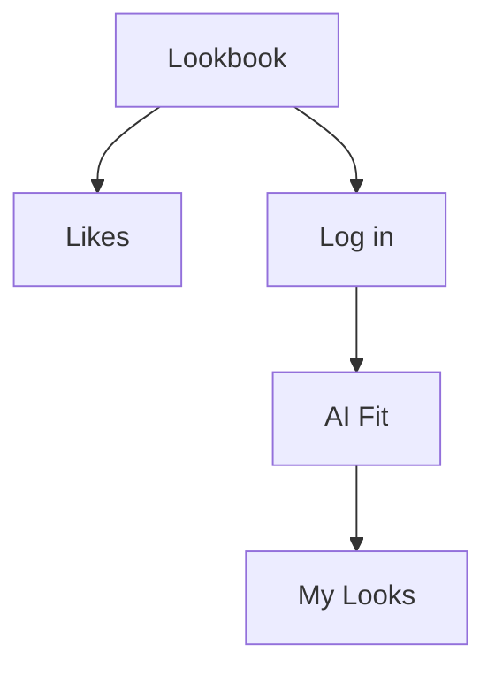

#tag

첫페이지 입니다.

![[Pasted image 20260630101120.png]]

![[Pasted image 20260702165226.png]]

#test

<svg xmlns="http://www.w3.org/2000/svg" viewBox="-2 -2 28 28" data-name="laugh" role="img" aria-label="face_laugh">
  <circle class="ins" cx="12" cy="12" r="5.2"/>
  <path class="ins" d="M 8.9 10.7 Q 9.9 9.4 10.9 10.7"/>
  <path class="ins" d="M 13.1 10.7 Q 14.1 9.4 15.1 10.7"/>
  <path class="ins-dot" d="M 8.9 12.9 Q 12 17.6 15.1 12.9 Z"/>
</svg>

